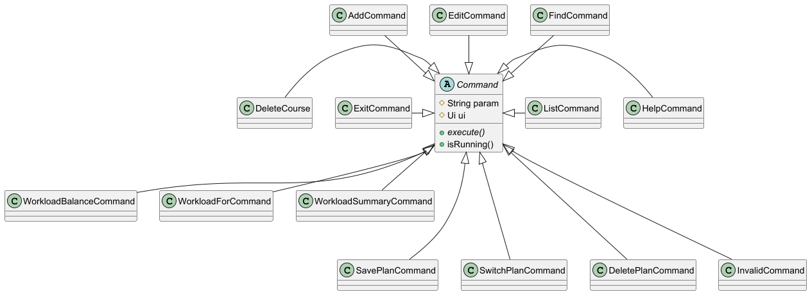
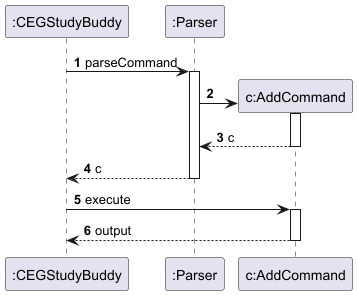

# Developer Guide

## Acknowledgement

This project builds upon the work of:

- [Rishi7830/ip](https://github.com/Rishi7830/ip)  
- [syCHEN1645/ip](https://github.com/syCHEN1645/ip)
- [HightechTR/ip](https://github.com/HightechTR/ip)

---

## Setting Up & Getting Started

First, fork the repo, and clone the fork into your computer.

If you plan to use IntelliJ IDEA (highly recommended):
### 1. Configure the JDK: Ensure IntelliJ is configured to use JDK 17.
Follow [this guide](https://se-education.org/guides/tutorials/intellijJdk.html) to configure IDEA.
### 2. Import the project as a Gradle project
Follow [this guide](https://se-education.org/guides/tutorials/intellijImportGradleProject.html) to import the project into IDEA. Note that importing a Gradle project differs slightly from importing a normal Java project.
### 3. Verify the setup:
Run the main class (CEGStudyBuddy.java) and try a few commands.\
Run the tests to ensure they all pass.


---

## Design

### Command Component
All of CEGStudyBuddy’s commands have their own command class, which are subclasses of an abstract Command class.



**How it Works:**

The `parseCommand` method in Parser (see below) returns one of the Command classes.\
The `execute()` method is then run to perform the tasks of the command given.\
The `isRunning()` method is asserted true for all commands except for `ExitCommand`, where it is asserted false.

---

### IO Components

The classes in the studybuddy.data.io package handle input/output functions.

---

#### 1. Parser

The Parser class is a utility class containing methods related to parsing command input.

**Methods:**

- `Command parseCommand`: Instantiates a Command subclass based on the input string.
- `Course parseCourse`: Instantiates a new Course class with the parameters in the input string.
- `Course getDefinedCourse`: Instantiates a predefined Course class with the parameters in the input string.
- `String parseDelete`: Deletes a course specified in the input string.
- `String[] parseEdit`: Returns a String array with parameters included in the input string for the edit command.
- `String[] parseFind`: Splits the input string and returns a String array with parameters included for the find command.
- `int[] parseWorkloadFor`: Splits the input string and returns an int array containing the year and semester for the workload_for command.

The Parser class is not intended to be instantiated.

---

#### 2. UI
The UI class is a utility class containing methods that print or return a string literal. These string literals include error/warning messages, user tips and other interaction messages.

**Methods:**

*As the methods are simple in both their purposes and implementations, 2 typical instances are listed below.

- `String parseIntErrorMessage`: Returns a string "Input cannot be converted to a valid number, please check your input".
- `void printCourse`: Takes in a course object and prints it to the output.

---

#### 3. CommandNames
The CommandNames class contains constants holding the command strings that are checked in the input. These are used in the parseCommand method in Parser.

---

### Course Component
The studybuddy.data package not only contains the aforementioned io package, but also the course package, which contains the classes for storing and handling courses.

---

#### 1. Course
The Course class represents a single course.

**Attributes:**

- `String code`: Course Code, e.g. CS2113.
- `String title`: Course Title/Name, e.g. Software Engineering & Object-Oriented Programming.
- `int mc`: Number of modular credits.
- `boolean offerInSem1`: Whether the course is offered in semester 1.
- `boolean offerInSem2`: Whether the course is offered in semester 2.
- `int takeInSem`: The semester the course is taken in.
- `int takeInYear`: The year the course is taken in.
- `boolean isCleared`: Whether the course has been cleared.

**Methods:**

- `String toString`: Returns a string representing the course.

---

#### 2. CourseList
The CourseList class stores the list of courses and contains methods to modify this course list.

**Attributes:**

- `ArrayList<Course> courses`: The course list itself.
- `String planName`: The name of the course plan the list is used in.

**Methods:**

- `Course setEditedParams`: Edits the parameters of the course.
- `void addCourse`: Adds a course to the list. Takes in a Course object.
- `ArrayList<Course> getCourses`: Returns the ArrayList of the courses.
- `boolean isEmpty`: True if the list is empty.

---

#### 3. CourseManager
The CourseManager class handles reading from the Defined_Courses file and conversion between Course objects and JSON strings.

**Attributes:**

- `String FILEPATH`: Path to the Defined_Courses file.
- `File file`: File object representing Defined_Courses.
- `Ui ui`: User interface object for displaying messages.

**Methods:**

- `Course jsonToCourse(String jsonString)`: Converts a JSON-formatted string into a Course object.
- `String courseToJson(Course course)`: Converts a Course object into a JSON-formatted string.
- `boolean ifDefined(String code)`: Checks and returns if a course code exists in the Defined_Courses file.
- `Course getCourse(String code)`: Retrieves a Course object from the Defined_Courses file based on the given course code.

---

### Storage Component
The studybuddy.data.storage package contains the StorageManager class.\
This section will also include information about the predefined list of courses, stored in Defined_Courses under the studybuddy.data.course class.

#### 1. StorageManager
The StorageManager class handles storage related tasks like creating new plans,  saving changes to plans and deleting plans. For storage, it uses the PlanData folder and creates one if needed.
- The `StorageManager` class handles all file-related operations.
- It creates a `PlanData` folder to store data if one doesn’t already exist.
- It loads the user’s course plan at startup and saves changes automatically.


**switch_plan**

This feature allows users to select or switch between course plans on startup.

---

#### 2. Predefined List of Courses
Since there is a fixed group of courses which must be completed to fulfill graduation requirements, users can just search for the course codes and load/import these courses from the database (a .txt file) with accurate and complete information. This prevents users from defining these courses themselves using inaccurate information or making careless mistakes such as typos. It also improves user experience by simplifying user input.

When adding a new course into the schedule through AddCommand, AddCommand will search the course code by calling static methods in CourseManager, with a boolean return value isDefined which indicates whether this course is already defined in the database. If true, AddCommand will get the defined course from CourseManager and add it to the schedule. If false, AddCommand will create a new course according to user input and add it to the schedule.

- There is a fixed group of courses to fulfill graduation requirements.
- These are stored in a database file (e.g., `.txt`) to ensure accuracy and avoid user errors.
- When adding a course:
  - The system checks if the course exists in the database via `CourseManager`.
  - If found, it uses that predefined information.
  - If not found, it accepts manual user input.


For the developers, this list is essential for other enhancement functions such as checking graduation requirements by comparing the users’ course plans with the list of core courses. To conveniently save and load from the list, Json dependency is added to convert between courses and Json Strings.

---

## Implementation

### Adding a Course
A simplified sequence diagram of the AddCommand class implementation:



---

## Appendix A: Product Scope

### Target User Profile

- Undergraduate students studying **Computer Engineering** at **NUS**
- Prefer desktop applications over mobile/web apps
- Comfortable with using **Command-Line Interfaces (CLI)**
- Can type quickly and accurately
- Want fast, structured ways to plan academic roadmaps
- Want to track courses, balance workload, and ensure graduation requirements are met
- Prefer minimal effort with maximum clarity of academic progress

### Value Proposition

**CEGStudyBuddy** helps Computer Engineering students manage their module planning in a faster, more organized, and minimalist way compared to GUI-based apps like NUSMods.  
It is optimized for typing-focused power users and automatically tracks MCs, graduation requirements, and allows editing or deleting modules via simple commands.  
It is **cross-platform** and **free**.

---

## Appendix B: User Stories

### Tracking and Planning Courses

- As a CEG student, I want to add a course to my study plan so I can track my progress toward graduation.
- As a CEG student, I want to remove a course from my study plan so I can update my roadmap if I change my mind.
- As a CEG student, I want to list all the courses I have added so that I can have an overview of my academic plan.
- As a CEG student, I want to delete courses I added by mistake so my plan remains accurate.

### Optimizing Workload and Schedule

- As a CEG student, I want to see my total workload in MCs per semester so that I can balance my workload and avoid overloading.
- As a student living in Pasir Ris, I want to plan my modules around travel time so I minimize time lost commuting.

### Graduation Requirements

- As a CEG student, I want to check which modules I still need to complete for graduation so that I can plan my semesters.
- As a CEG student, I want to be warned if I add a course without prerequisites so I don’t enroll in courses I’m not eligible for.

### Keeping Students Organized & On Track

- As a CEG student, I want to search for a course by its course code or name so I can quickly find relevant details about it.

---

## Appendix C: Non-functional Requirements

- Should work on any mainstream OS with Java 17 installed
- Should be able to handle up to 100 courses
- All features must be accessible via CLI commands only (no GUI required)
- A user with decent typing speed should be able to perform tasks faster than in GUI-based alternatives
- Should be memory-efficient and not require persistent internet access

---

## Appendix D: Glossary

| Term             | Definition                                                    |
|------------------|---------------------------------------------------------------|
| Module Code      | Official code of an NUS course, e.g., `CS2040C`               |
| MC               | Modular Credit – indicates course weight                      |
| Course List      | The user’s personalized list of planned/taken courses         |
| Command Parser   | Handles interpretation of typed commands                      |
| Workload Tracker | Computes workload distribution across semesters               |
| Graduation Checker | Validates whether graduation requirements (160 MCs) are met |
| CLI              | Command-Line Interface – user types commands via text         |
| Mainstream OS    | Windows, Linux, macOS                                         |

---

## Appendix E: Instructions for Manual Testing

#### Launching the Application

1. Ensure Java 17 is installed.
2. Download the `.jar` file and place it in an empty folder.
3. Open Command Prompt (Windows) or Terminal (macOS/Linux).
4. Navigate to the folder using `cd`.
5. Run the program:
   ```java -jar cegstudybuddy.jar```
   

---

### Adding a Course

Command:
```
add c/CS2040 t/Data Structures mc/4 y/2 s/1
```

**Test Cases:**
- Omitting slashes (e.g., `c CS2040`)
- Missing required tags (e.g., no `mc/`)
- Negative MCs (e.g., `mc/-4`)
- Using letters in year or semester fields

---

### Deleting a Course

Command:
```
delete c/CS2040
```

**Test Cases:**
- Missing `c/` tag
- Non-existent module codes
- Lowercase codes (should still work)

---

### Editing a Course

Command:
```
edit c/CS2040 t/Advanced Data mc/5 y/2 s/2
```

**Test Cases:**
- Missing `c/` (primary identifier)
- Invalid year/sem values
- Only one optional tag (should still work)

---

### Listing Courses

Command:
```
list
```

**Test Cases:**
- When course list is empty (should show message)
- When course list is long (check readability)

---

### Finding a Course

Command:
```
find c/CS2040
```

**Test Cases:**
- Finding non-existent course
- Missing `c/`
- Using lowercase input (should work)

---

### Viewing Workload

Command:
```
workload
```

**Test Cases:**
- After adding 6+ courses, check that MCs are grouped by semester correctly

---

### Viewing Graduation Requirement

Command:
```
gradreq
```

**Test Cases:**
- Below 160 MCs → motivational message + thumbs up emoji
- 160 MCs or more → celebratory message + graduation ASCII/emoji

---
```


