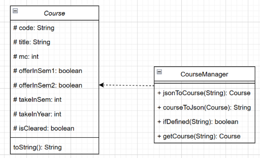

# Developer Guide

## Acknowledgement

This project builds upon the work of:

- [Rishi7830/ip](https://github.com/Rishi7830/ip)  
- [syCHEN1645/ip](https://github.com/syCHEN1645/ip)

---

## Setting Up & Getting Started

### Java Setup

Ensure you have **Java 17** installed on your computer.  
You may download it from [here](https://www.oracle.com/java/technologies/javase/jdk17-archive-downloads.html).

- **Windows Users**: Any Windows installer will work, but the Windows x64 Installer is recommended.
- **Mac Users**:
  - Use the macOS x64 DMG Installer if your Mac has an Intel CPU.
  - Use the macOS Arm 64 DMG Installer if your Mac has an Apple M-series CPU.
- **Linux Users**:
  - Use the Debian Package for Debian-based distros (Ubuntu, Linux Mint).
  - Use the RPM Package for Red Hat-based distros (Fedora, CentOS).

### Running the Application

1. Download the latest `.jar` file for **CEGStudyBuddy** [here](http://link.to/cegstudybuddy).
2. Copy and paste the `.jar` file into your desired folder. This folder will serve as the working home folder.
3. Open a terminal in the folder:
   - **Windows**: Right-click in the folder and select *Open in Terminal*.
   - **Mac/Linux**: Use the `cd` command in Terminal to navigate to the folder.
4. Run the application using:
   ```java -jar cegstudybuddy.jar```
   
5. Input a command and press `ENTER` to execute it.

---

## Product Scope

### Target User Profile

- Undergraduate students studying **Computer Engineering** at **NUS**
- Prefer desktop applications over mobile/web apps
- Comfortable with using **Command-Line Interfaces (CLI)**
- Can type quickly and accurately
- Want fast, structured ways to plan academic roadmaps
- Want to track courses, balance workload, and ensure graduation requirements are met
- Prefer minimal effort with maximum clarity of academic progress

### Value Proposition

**CEGStudyBuddy** helps Computer Engineering students manage their module planning in a faster, more organized, and minimalist way compared to GUI-based apps like NUSMods.  
It is optimized for typing-focused power users and automatically tracks MCs, graduation requirements, and allows editing or deleting modules via simple commands.  
It is **cross-platform** and **free**.

---

## User Stories

### Tracking and Planning Courses

- As a CEG student, I want to add a course to my study plan so I can track my progress toward graduation.
- As a CEG student, I want to remove a course from my study plan so I can update my roadmap if I change my mind.
- As a CEG student, I want to list all the courses I have added so that I can have an overview of my academic plan.
- As a CEG student, I want to delete courses I added by mistake so my plan remains accurate.

### Optimizing Workload and Schedule

- As a CEG student, I want to see my total workload in MCs per semester so that I can balance my workload and avoid overloading.
- As a student living in Pasir Ris, I want to plan my modules around travel time so I minimize time lost commuting.

### Graduation Requirements

- As a CEG student, I want to check which modules I still need to complete for graduation so that I can plan my semesters.
- As a CEG student, I want to be warned if I add a course without prerequisites so I don’t enroll in courses I’m not eligible for.

### Keeping Students Organized & On Track

- As a CEG student, I want to search for a course by its course code or name so I can quickly find relevant details about it.

---

## Non-functional Requirements

- Should work on any mainstream OS with Java 17 installed
- Should be able to handle up to 100 courses
- All features must be accessible via CLI commands only (no GUI required)
- A user with decent typing speed should be able to perform tasks faster than in GUI-based alternatives
- Should be memory-efficient and not require persistent internet access

---

## Glossary

| Term             | Definition                                                    |
|------------------|---------------------------------------------------------------|
| Module Code      | Official code of an NUS course, e.g., `CS2040C`               |
| MC               | Modular Credit – indicates course weight                      |
| Course List      | The user’s personalized list of planned/taken courses         |
| Command Parser   | Handles interpretation of typed commands                      |
| Workload Tracker | Computes workload distribution across semesters               |
| Graduation Checker | Validates whether graduation requirements (160 MCs) are met |
| CLI              | Command-Line Interface – user types commands via text         |
| Mainstream OS    | Windows, Linux, macOS                                         |

---

## Design

### Architecture

TBD

### UI Component

Handles user input and CLI-based interactions.

### Parser Component

Interprets the command typed by the user and calls the appropriate logic.

### Storage Component
### Course Plan
The StorageManager class handles storage related tasks like creating new plans,  saving changes to plans and deleting plans. For storage, it uses the PlanData folder and creates one if needed.
- The `StorageManager` class handles all file-related operations.
- It creates a `PlanData` folder to store data if one doesn’t already exist.
- It loads the user’s course plan at startup and saves changes automatically.


### switch_plan

This feature allows users to select or switch between course plans on startup.

---

## Predefined List of Courses
Since there is a fixed group of courses which must be completed to fulfill graduation requirements, users can just search for the course codes and load/import these courses from the database (a .txt file) with accurate and complete information. This prevents users from defining these courses themselves using inaccurate information or making careless mistakes such as typos. It also improves user experience by simplifying user input.

When adding a new course into the schedule through AddCommand, AddCommand will search the course code by calling static methods in CourseManager, with a boolean return value isDefined which indicates whether this course is already defined in the database. If true, AddCommand will get the defined course from CourseManager and add it to the schedule. If false, AddCommand will create a new course according to user input and add it to the schedule.

- There is a fixed group of courses to fulfill graduation requirements.
- These are stored in a database file (e.g., `.txt`) to ensure accuracy and avoid user errors.
- When adding a course:
  - The system checks if the course exists in the database via `CourseManager`.
  - If found, it uses that predefined information.
  - If not found, it accepts manual user input.


 

For the developers, this list is essential for other enhancement functions such as checking graduation requirements by comparing the users’ course plans with the list of core courses. To conveniently save and load from the list, Json dependency is added to convert between courses and Json Strings.


## Implementation

### Instructions for Manual Testing

#### Launching the Application

1. Ensure Java 17 is installed.
2. Download the `.jar` file and place it in an empty folder.
3. Open Command Prompt (Windows) or Terminal (macOS/Linux).
4. Navigate to the folder using `cd`.
5. Run the program:
   ```java -jar cegstudybuddy.jar```
   

---

### Adding a Course

Command:
```
add c/CS2040 t/Data Structures mc/4 y/2 s/1
```

**Test Cases:**
- Omitting slashes (e.g., `c CS2040`)
- Missing required tags (e.g., no `mc/`)
- Negative MCs (e.g., `mc/-4`)
- Using letters in year or semester fields

---

### Deleting a Course

Command:
```
delete c/CS2040
```

**Test Cases:**
- Missing `c/` tag
- Non-existent module codes
- Lowercase codes (should still work)

---

### Editing a Course

Command:
```
edit c/CS2040 t/Advanced Data mc/5 y/2 s/2
```

**Test Cases:**
- Missing `c/` (primary identifier)
- Invalid year/sem values
- Only one optional tag (should still work)

---

### Listing Courses

Command:
```
list
```

**Test Cases:**
- When course list is empty (should show message)
- When course list is long (check readability)

---

### Finding a Course

Command:
```
find c/CS2040
```

**Test Cases:**
- Finding non-existent course
- Missing `c/`
- Using lowercase input (should work)

---

### Viewing Workload

Command:
```
workload
```

**Test Cases:**
- After adding 6+ courses, check that MCs are grouped by semester correctly

---

### Viewing Graduation Requirement

Command:
```
gradreq
```

**Test Cases:**
- Below 160 MCs → motivational message + thumbs up emoji
- 160 MCs or more → celebratory message + graduation ASCII/emoji

---
```


