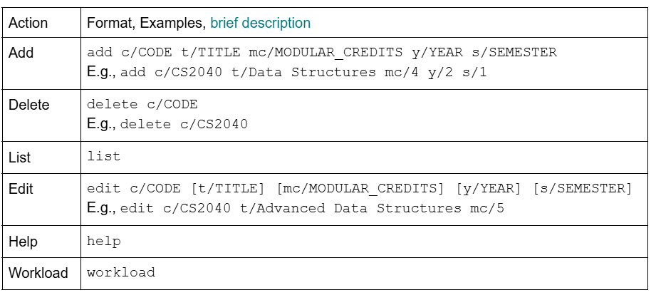

# User Guide

## Introduction

CEGStudyBuddy is a desktop application that tracks and plans university courses efficiently for NUS Computer Engineering students who want a structured academic roadmap. It helps to optimise workload, ensure graduation requirements, and keep students organised with ease.

This application is designed to be optimised for a Command Line Interface (CLI). If you are a fast typer, you can plan and track your courses faster than NUSMods.

## Quick Start

Ensure you have Java 17 installed on your computer.
You may download Java 17 from here.

For Windows Users:
Any Windows installer will work, but the Windows x64 Installer is recommended for ease of use.

For Mac Users:
The DMG installer is recommended. However, please note down the CPU of your Mac.
Use the macOS x64 DMG Installer if your Mac has an Intel CPU, or the macOS Arm 64 DMG Installer if your Max has an Apple M-series CPU.

For Linux Users:
Check instructions for your distribution as installation may differ between distros. Generally, use the Debian Package for Debian-based distros (Ubuntu, Linux Mint) and the RPM Package for Red Hat-based distros (Fedora, CentOS).

Download the latest .jar file.
You may download the latest .jar file for CEGStudyBuddy here.

Place the .jar file in a desired home folder.
Copy and paste the file to any desired folder on your computer.
The folder it will be in will serve as the working home folder for CEGStudyBuddy.

Run the application from the terminal.
Right-click an empty space in the home folder and select Open in Terminal.
Alternatively, you may open Terminal and cd into the home folder.

Run the command java -jar cegstudybuddy.jar to start the application in the terminal.

Input a command.
Type the command you would like to input into the terminal and press Enter to execute it.

You may refer to Features below for a full list of each command and its details.

## Features

### Notes about the Command Format
Adds a new item to the list of todo items.
Words in UPPER_CASE are parameters that must be supplied by the user.
For example, in add c/CODE, CODE is a parameter that may be used as add c/CS2113.
Parameters wrapped in square brackets [] are optional.
For example, in edit c/CODE [t/TITLE], TITLE is an optional parameter.
Extraneous parameters for commands that do not take parameters, such as list, will be ignored.

### Adding a Course: `add`
Adds a course to the planner.

Format:
`add c/CODE t/TITLE mc/MODULAR_CREDITS y/YEAR s/SEMESTER`

Examples:

`add c/CS2040 t/Data Structures mc/4 y/2 s/1`

`add c/MA1101 t/Linear Algebra mc/4 y/1 s/2`

### Deleting a Course: delete
Removes a course from the planner.

Format:
`delete c/CODE`

Examples:

`delete c/CS2040`

`delete c/MA1101`

### Listing Courses: list
Displays all added courses.

Format:
`list`

Example Output:

`CS2040 - Data Structures (4 MCs) - Year 2 Semester 1 ` 

`MA1101 - Linear Algebra (4 MCs) - Year 1 Semester 2 `

### Editing a Course: edit
   Modifies course details.
   Inputting any parameter will overwrite the old parameter assigned to the course.
   At least one of the optional fields must be provided.

Format:
`edit c/CODE [t/TITLE] [mc/MODULAR_CREDITS] [y/YEAR] [s/SEMESTER]`

Examples:
`edit c/CS2040 t/Advanced Data Structures mc/5`
`edit c/MA1101 y/2 s/1`

### Help Command: help
Displays available commands and a link to the help page.

Format:
`help`

Example Output:
Available Commands:
1. add c/CODE t/TITLE mc/MODULAR_CREDITS y/YEAR s/SEMESTER - Adds a course.
2. delete c/CODE - Deletes a course.
3. list - Lists all courses.
4. edit c/CODE [t/TITLE] [mc/MODULAR_CREDITS] [y/YEAR] [s/SEMESTER] - Edits a course.

### Workload Command: workload
Displays the total Modular Credits (MCs) for each semester over 4 years.
Maybe can set up the mini and max workload for each semester such that students can balance the workload and graduate successfully.

Format:
`workload`

Example Output:

Year 1 Semester 1: 16 MCs

Year 1 Semester 2: 18 MCs

Year 2 Semester 1: 20 MCs

Year 2 Semester 2: 16 MCs

Year 3 Semester 1: 18 MCs

Year 3 Semester 2: 16 MCs

Year 4 Semester 1: 14 MCs

Year 4 Semester 2: 12 MCs

### Wokload Balance Command : workload_balance
To check the balance of your workload across the semester, you can use this command to see minimum and maximum credits take in a sem across your semesters in university. This takes no parameters.

Format:
`workload_balance`

### Workload Summary Command: workload_summary
This command displays a list of courses in the semester and the total workload.

Format: 
`workload_summary y/<year of study> s/<semester of study>`
### Save Command: save
For any course plan, you have to save the data to your computer using the save command. On fully saving the command, you will see the output :

Plan Saved.

This command takes no other user input.

Format 
`save`
### Switch Plan Command: switch_plan
This command allows you to switch to a pre-existing plan or create a completely new plan. It takes no parameters.
After entering the command please follow the further instructions and given by the software.

Format:
`switch_plan`

## FAQ

* For detailed instructions, visit: https://docs.google.com/document/d/1BYTlajOCgwL7bUaDveu3yrMp9dUQFgjM5Xe7gw2Bl-I/edit?tab=t.0

## Command Summary

